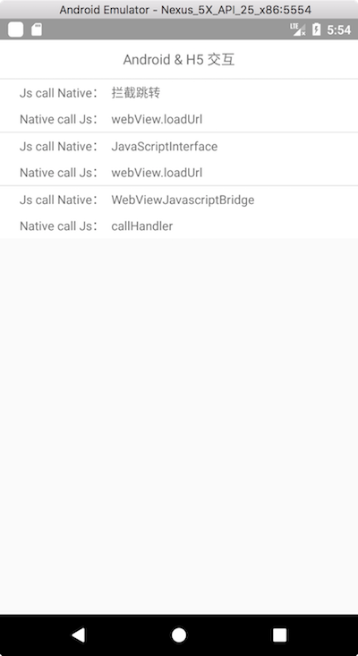

# jsinterface

#### 说明
本项目是为我们系列博客做的Demo，Demo中包括了Android <=> Js 、iOS <=> Js 交互的所有常见方式，包括拦截跳转、JSContext、@JavaScriptInterface、JSBridge等等。有兴趣的朋友可以下载下来看看

#### 博客地址：
- [《App与Js交互（一）iOS》](https://www.jianshu.com/p/13b65557c27f)
- [《App与Js交互（二）Android》](https://www.jianshu.com/p/5a511e03a7fa)
- [《App与Js交互（三）Android、iOS通用解决方案推荐》](https://www.jianshu.com/p/6224f429ce87)

#### Demo 预览
 